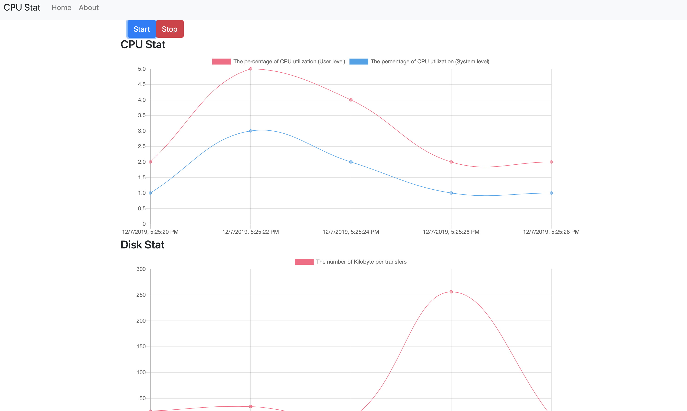

## Realtime CPU Statistics built with Nodejs, Websocket, and ChartJs

Getting started:

install dependencies
```
$ npm install
```

running
```
$ npm start
```

visit `http://localhost:8000/`

<div align="center">

[](https://github.com/telkomdev/node-cpu-stat)
<br/><br/>
</div>